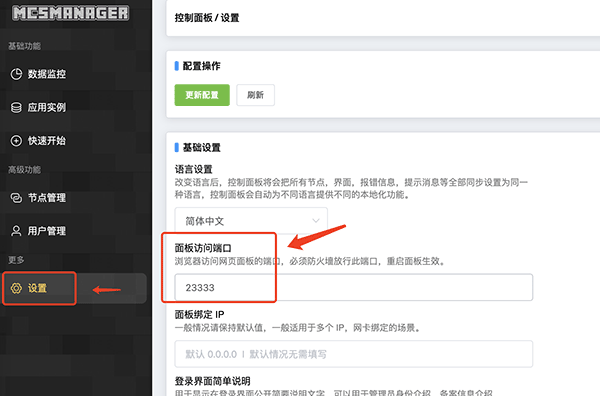
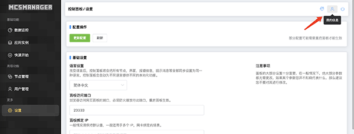
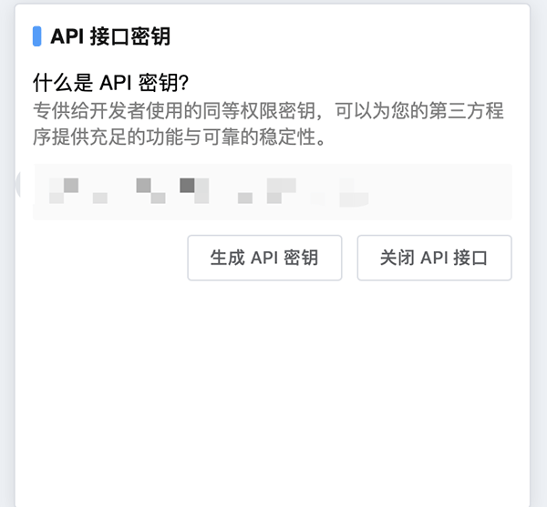
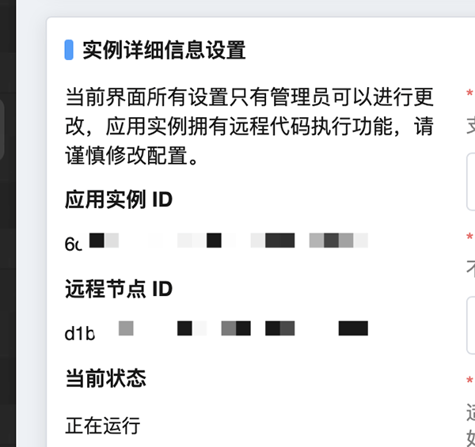

# MCSManager设置指南
MCSManager 面板（简称：MCSM 面板）是一款免费，开源，分布式，轻量级，快速部署，支持 Minecraft 和 Steam 游戏服务器的 Web 管理面板。  
>MCSManager安装教程请参考[官方文档](https://docs.mcsmanager.com/zh_cn/)。  
   
WeAuth可以与MCSManager安装在同一个服务器上，但是，该服务器的80/443端口必须能被外界访问到。  
### 第一步 进入后台，确定MCSManager使用的端口
默认情况下为23333端口。
   
### 第二步 开启API并记录API密钥
点击右上角我的信息  
  
生成API密钥  
  
* 该API密钥即为`config.yaml`文件中的`mcsm_api`  
### 第三步 记录运行Minecraft服务器的实例的信息
>如何装载Minecraft服务器到应用实例请参考官方教程  
  

点击【应用实例】，选择运行Minecraft服务器的实例进去，再点击【高级实例设置】。  
  
* 应用实例ID对应`config.yaml`中的uuid
* 远程节点ID对应`config.yaml`中的remote-uuid  
   
### MCSM面板的地址
如果WeAuth与MCSM同在一个服务器，可以填写
```yaml
mcsm_adr: http://127.0.0.1:23333/
```   
其中23333为端口号。  
如果WeAuth与MCSM不在同一个服务器，请填写MCSM的IP或域名地址。  
```yaml
mcsm_adr: http://8.8.8.8:23333/
```     


 