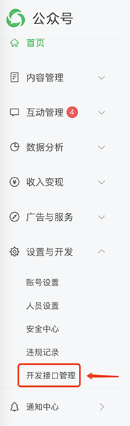
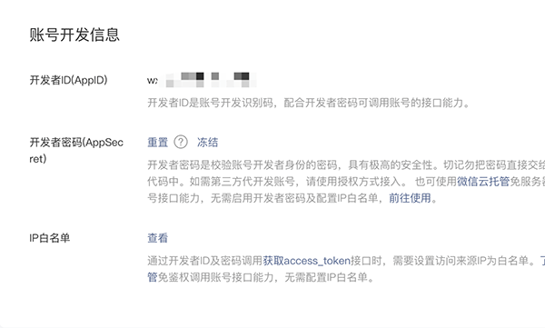
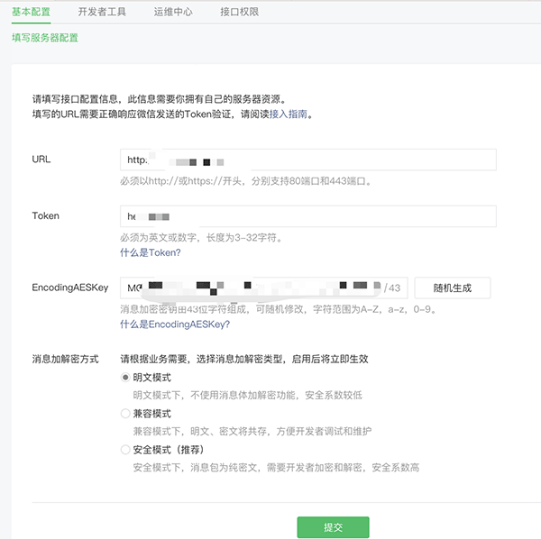
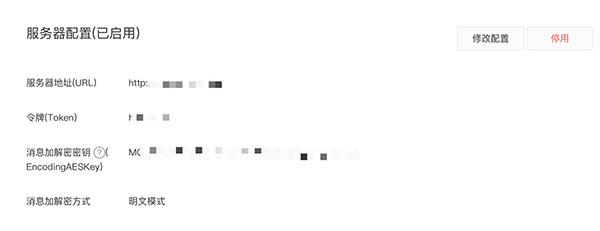
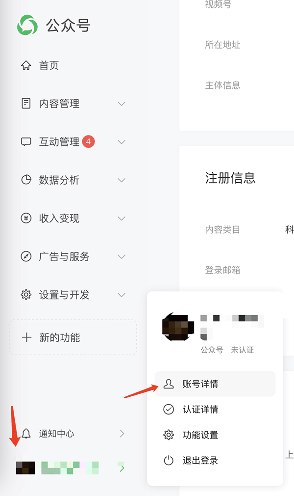
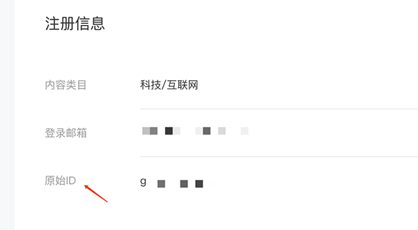

# 微信公众号后台设置指南  

### 第一步 注册微信公众号

https://mp.weixin.qq.com  

### 第二步 登录后台，开发接口管理
  

### 第三步 记录开发者ID(AppID)、开发者密码(AppSecret)和设置IP白名单

* 请将AppID与AppSecret填入`config.yaml`文件中的对应位置。  
* 其中，开发者密码(AppSecret)只会显示一次。  
* 将运行WeAuth的服务器IP地址填入IP白名单  

### 第四步 验证你的服务器地址
在开发接口管理中修改服务器配置  
  
其中，URL是运行WeAuth服务器的地址，且路由默认为/wx  
如  
`http://8.8.8.8/wx`  
或  
`http://test.myserver.com/wx`  
Token由您自己任意填写，但请与`weauth -t [token]`保持一致，config.yaml中也填写这个token  
EncodingAESKey将在后续支持，目前请将消息加解密方式选择明文。  

* 先启动WeAuth的验证模式`weauth -w -t [token]`, 再在该页面选择提交。如果一切正常，会显示验证成功。   
  

验证成功后会显示您的服务器地址，如图。  

### 微信公众号原始ID
`config.yaml`文件还需要填写微信公众号原始ID。  
点击左下角公众号头像，【账号详情】。便可以在【注册信息】中找到原始ID。  
  
  

### 测试功能是否正常  
完成上面步骤后，如果有微信用户和您的公众号产生交互(向公众号发送内容、订阅公众号、取消公众号)，微信会向WeAuth发送信息。  
您可以继续使用WeAuth的验证模式`weauth -w -t [token]`来观察是否收到了微信的请求。  
如果要正式运行WeAuth，您还需要[配置MCSManager](MCSManagerConfig.md)或者[rcon](Rcon.md)相关信息。  

