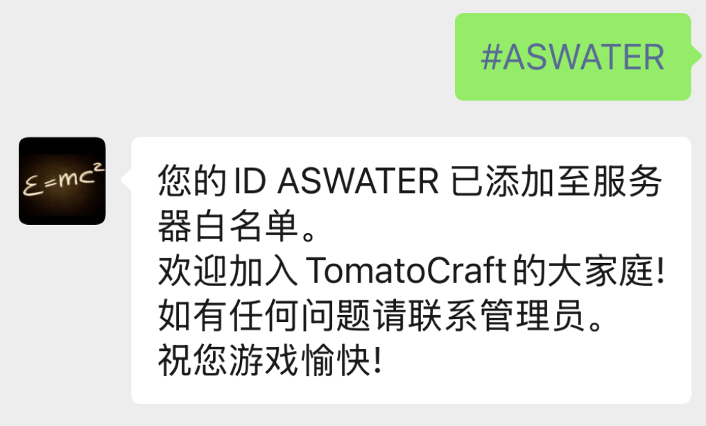

启动WeAuth与指令控制
==================

当您完成微信服务器设置与游戏服务器设置并测试成功后，便可以正式运行WeAuth。

您可以通过微信公众号，或者直接在命令行中输入指令对WeAuth进行指令控制。

启动WeAuth
----------

WeAuth是一个web服务，需要常驻在系统中运行。您可以使用 `Screen工具 <https://www.gnu.org/software/screen/>`__ 实现这一点。

如果您的Linux系统没有安装Screen工具，您可以使用以下命令安装：

.. code-block:: bash

    sudo apt install screen

或

.. code-block:: bash

    sudo yum install screen

安装完成Screen后，您可以新建Screen会话，并命名为weauth：

.. code-block:: bash

    screen -S weauth

然后进入WeAuth运行的文件夹，

.. code-block:: bash

    cd WeAuth

直接启动WeAuth

.. code-block:: bash

    weauth

如果一切正常，WeAuth会提示开始监听。用户可以通过向公众号发送 ``#自己的ID`` 来添加白名单。

此时您可以通过 ``Ctrl`` + ``A`` 再按 ``D`` 键，即可退出Screen会话，而WeAuth仍会正常监听中。

您可以重新进入Screen会话，使用：

.. code-block:: bash

    screen -r weauth

使用指令来管理WeAuth
------------------

不同于Minecraft Server需要在程序内的控制台中运行指令。您可以在程序外运行WeAuth指令。

我们提供了直接通过微信公众号运行指令和通过命令行来管理WeAuth两种方式。

其中，通过微信公众号运行指令需要您事先将ID加入超级管理员列表。

您可以进入WeAuth的文件夹：

.. code-block:: bash

    cd WeAuth

然后打开手机微信，在公众号中发送 ``#您自己的游戏ID`` 。这样将您的游戏ID加入 ``WeAuth.db`` 中。

再输入指令：

.. code-block:: bash

    weauth -sop 您的游戏ID

这样将您添加进了超级管理员，您此时可以通过微信公众号发送指令来管理WeAuth。（指令见下文）

.. note::
    我们建议通过微信公众号指令来管理WeAuth，您也可以通过命令行来管理WeAuth。两者区别在于，命令行进行的操作不会同步到游戏服务器中。

    例如在微信公众号封禁玩家，则Minecraft Server也会封禁该ID。而在命令行封禁玩家，只会在 ``WeAuth.db`` 中添加封禁标记。

微信公众号指令
------------

目前可在微信公众号直接发送四类文字指令：白名单注册申请指令、游戏指令、WeAuth指令和CDKey兑换指令。

白名单注册申请指令使用 ``#`` 作为前缀。

游戏指令使用 ``@`` 作为前缀，仅管理员和超级管理员可以使用。

WeAuth指令使用 ``!`` 作为前缀，仅超级管理员可以使用。（英文的半角感叹号）

CDKey兑换指令使用 ``$`` 作为前缀。

**前缀和指令之间均无空格！**

白名单注册申请指令
~~~~~~~~~~~~~~~

所有用户均可使用 ``#myid`` 运行白名单注册申请指令，若该ID被封禁则会提示“被封禁”。

游戏指令
~~~~~~~

管理员和超级管理员可以使用 ``@`` 作为前缀，发送Minecraft Server的游戏指令。

例如：``@time set 1000`` , ``@kill player_id`` , ``@give @a minecraft:torch 64`` 。

.. note::
    如果您使用MCSManager作为连接服务器方式，则不会收到发送指令后的反馈。

WeAuth指令
~~~~~~~~~

超级管理员可以使用 ``!`` 作为前缀（英文的半角感叹号），发送WeAuth程序的指令。

.. code-block:: python

    !op [ID]
    # 将ID加入ops.yaml中的普通管理员(可以在公众号发出游戏内指令)

    !sop [ID]
    # 将ID加入ops.yaml中的超级管理员(可以在公众号中发出WeAuth指令)

    !v
    # 查看WeAuth版本信息

    !g [mineID] [mineNum] [cdkeyNum] [comment]
    # 生成礼物

    !l
    # 显示所有用户ID

    !s [player_id]
    # 显示该用户ID的封禁、订阅情况

    !b [player_id]
    # 封禁该用户，同时会移出白名单

    !ub [player_id]
    # 移出封禁

    !d [player_id]
    # 在数据库中删除该玩家信息，会自动移出白名单

    !u [player_id] [is_ban] [is_sub]
    # 手动更新该玩家是否封禁标志与是否订阅标志 （会自动同步到游戏服务器）

.. note::
    WeAuth指令不同于启动参数，其不仅会更改WeAuth本地数据，还会同步至MC Server。

CDKey兑换
~~~~~~~~~

CDKey兑换指令使用 ``$`` 作为前缀。例如，输入 ``#tpFV-Psb5-fHPH-J10h`` ，即可进行兑换。

- 只有已注册白名单的玩家才能进行兑换，其他用户进行兑换会被WeAuth忽略。

- 如果使用MCSManager作为连接，WeAuth只会在核销前确认能否连接到MCSManager，不会对兑换结果进行任何验证。

- 如果使用Rcon作为连接，WeAuth会确认兑换结果，包括玩家不在线情况、物品ID不合法情况。若兑换失败，CDKey不会被消耗，且玩家在微信公众号会收到反馈。

兑换完成后， ``cdkey.yaml`` 中的兑换码会被删除， ``gift_list.yaml`` 中的 ``gift_total`` 会自动减1。

若兑换时 ``gift_total`` 已小于等于0，则会提醒兑换失败。

CDKey生成（通过微信）
~~~~~~~~~~~~~~~~~~

.. code-block:: python

    !g [mineID] [mineNum] [cdkeyNum] [comment]
    # 生成礼物

其中，``mineID`` 为Minecraft物品ID，``mineNum`` 为单次赠送物品的数量，``cdkeyNum`` 为生成CDKey的数量，``comment`` 为礼物的注释。

例如：

.. code-block:: python

    !g minecraft:torch 64 5 给朋友送的火把

生成成功则会返回CDKey列表，您也可以在 ``cdkey.yaml`` 文件中查看。

命令行指令
---------

除了使用微信公众号来管理WeAuth，您也可以直接在服务器命令行来管理WeAuth。

管理程序与监听程序是解耦的，您可以在存在一个WeAuth监听会话的情况下，在另一个会话中直接使用管理指令。

直接启动服务器
~~~~~~~~~~~~

.. code-block:: bash

    weauth

这是当您配置完成所有设置后，正式进入运行的方式。

WeAuth会开始监听来自微信服务器的消息，您可以使用screen工具将WeAuth放入后台，这样您退出终端也不会停止WeAuth运行。

.. code-block:: bash

    screen -S wa
    weauth
    # 此时，同时敲击键盘ctrl 和 A ， 然后再敲击 D ，便可将WeAuth放入后台

    screen -r wa
    # 即可回到运行WeAuth的终端

测试模式
~~~~~~~

.. code-block:: bash

    # 仅供开发使用
    weauth -test

    # 用于测试与微信服务器连接（1.6.1起支持）
    weauth -wtest

    # 用于测试与游戏服务器连接（1.6.1起支持）
    weauth -gtest

    # 查看版本
    weauth -v

    # 查看启动参数帮助信息
    weauth -h

CDKey生成
~~~~~~~~

.. code-block:: bash

    weauth -g

    -请输入礼物注释,并按回车确认。例如: 火把/钻石/给小张的礼物
    >新年礼物
    -请输入单次兑换所给予的数量,并按回车确认。例如: 6
    >16
    -请输入礼物,可以带有NBT标签。
    >minecraft:cooked_beef
    -请输入生成CDKey数量
    >20

礼物信息会保存在 ``gift_list.yaml`` ， CDKeys会保存在 ``cdkey.yaml`` 。

名词解释
^^^^^^^

- 礼物注释，即礼物说明，用来记录礼物的用途。在 ``gift_list.yaml`` 中记录为 ``gift_comment`` 。

- 礼物，即礼物名称，指Minecraft的物品代码（物品ID），可以带有NBT标签。在 ``gift_list.yaml`` 中记录为 ``gift_arg`` 。

- 单次兑换所给予的数量，在 ``gift_list.yaml`` 中记录为 ``gift_num`` 。即Minecraft指令中的 ``give @p minecraft:torch [num]`` 。

- 生成CDKey数量,在 ``gift_list.yaml`` 中记录为 ``gift_total`` 。也是对应在 ``cdkey.yaml`` 中生成的兑换码数量。玩家兑换成功时会自动减少。

生成机制
^^^^^^^

每个礼物会根据 ``gift_arg`` 、 ``gift_num`` 和 ``gift_total`` 生成唯一的哈希值 ``gift_hash`` 。

``gift_hash`` 会成为 ``cdkey.yaml`` 文件中，连接兑换码和对应礼物的唯一索引。

你可以设置 ``gift_list.yaml`` 中的 ``valid`` 为 ``false`` （小写，yaml文件格式要求）。
这样，该礼物对应的所有兑换码会被拒绝兑换。

管理员与超级管理员设置
~~~~~~~~~~~~~~~~~~

管理员与超级管理员的ID会保存在 ``ops.yaml`` 中。

管理员是指可以在微信公众号直接发送游戏指令的用户。

超级管理员是指在管理员基础上，可以在微信公众号直接发送WeAuth指令的用户。

.. code-block:: bash

    weauth -op [ID]
    # 将ID加入ops.yaml中的普通管理员(可以在公众号发出游戏内指令)

    weauth -sop [id]
    # 将ID加入ops.yaml中的超级管理员(可以在公众号中发出WeAuth指令)

数据库操作
~~~~~~~~

可以使用启动参数来对数据库 ``WeAuth.db`` 进行查、删、改。但在目前版本，不同于在微信公众号执行指令，在启动参数上进行查、删、改不会同步到游戏服务器。

.. code-block:: bash

    weauth -list
    # 显示所有用户ID

    weauth -search [play_id]
    # 显示该用户ID的封禁、订阅情况

    weauth -ban [player_id]
    # 封禁该用户(仅本地数据库)

    weauth -unban [player_id]
    # 移出封禁(仅本地数据库)

    weauth -del [player_id]
    # 在数据库中删除该玩家信息(仅本地数据库)

    weauth -update [player_id] -b -s
    # 手动更新该玩家是否封禁标志与是否订阅标志(仅本地数据库)

自动备份系统
----------
