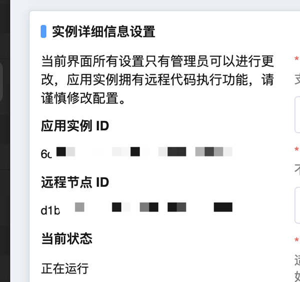

使用MCSM连接游戏服务器
=========================

`MCSManager <https://mcsmanager.com>`__ （以下简称MCSM），中文常称作“MCSM面板”，是一款深受玩家群体喜爱的可视化服务器web管理工具。

MCSM可以开启api，供外界访问并管理其内部的实例对象。本教程将假设您已安装MCSM并创建了Minecraft服务端实例。

.. note::
    MCSManager的安装请参考 `官方教程 <https://docs.mcsmanager.com/zh_cn/>`__ 。

获取MCSM运行信息和API密钥
----------------------

如果通过MCSM连接游戏服务器，WeAuth的 ``config.yaml`` 文件中共有五处信息需要填写。

.. code-block:: yaml

    # 游戏服务器连接方式，0 为MCSManager，1 为rcon
    server_connect: 0
    # MCSM的url地址
    mcsm_adr: http://服务器地址:端口/
    # MCSM的api密钥
    mcsm_api:
    # MCSM实例的应用实例ID
    uuid:
    # MCSM实例的远程节点ID
    remote-uuid:

MCSM的url地址
~~~~~~~~~~~~

默认情况下为23333端口。如果WeAuth和MCSM在同一个服务器，则url地址为 ``http://127.0.0.1:23333/`` 。

MCSM的API密钥
~~~~~~~~~~~~~

点击右上角"我的信息"。

.. figure:: img/pic6.png

生成API密钥

uuid与remote-uuid
~~~~~~~~~~~~~~~~~~

点击“应用实例”，选择运行Minecraft服务器的实例进去，再点击“高级实例设置”。

应用实例ID对应config.yaml中的 ``uuid``

远程节点ID对应config.yaml中的 ``remote-uuid``

测试与MCSM连接
~~~~~~~~~~~~~

您可以运行WeAuth的游戏端测试模式。（1.6.1起支持）

.. code-block:: bash

    weauth -gtest

如果配置正确，则会提示连接成功。

使用frp进行MCSM连接
~~~~~~~~~~~~~~~~~

您也可以使用frp工具搭建隧道实现MCSM连接，可用于MC Server无固定公网IP情况。

具体请参考下一节。