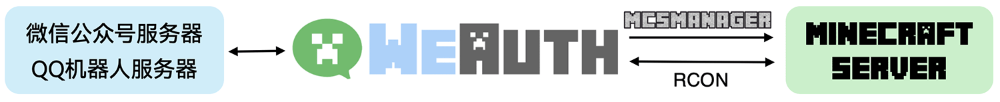

WeAuth的作用和工作方式
====================
WeAuth是用Python开发的轻量web服务端，用来连接微信公众号与您的Minecraft服务器。

在完成配置后，您可以直接在微信公众号管理MC服务器、注册和管理玩家白名单与生成与兑换CDKey。

值得一提的是，WeAuth在未来还将添加更多功能并支持QQ机器人。

WeAuth的工作方式
-----------

你可以将WeAuth想象为一个信息传递员，它的左手是来自微信服务器的消息，右手是您的MC服务器。

当您向公众号发送特定前缀的消息，WeAuth会收到来自微信服务器的消息并进入命令处理管线。

假设您发送了一条消息为 ``#MyMinecraftID``。其中，"#"代表是白名单注册命令。WeAuth在收到消息后会对数据库进行检查，如果玩家ID为“MyMinecraft”的用户没有注册，则会将其加入
数据库，并生成游戏指令 ``whitelist add MyMinecraftID`` 发送至MC服务器。

连接Minecraft Server的两种方式
~~~~~~~~~~~~~~~~~~~~~~~~~~~~

WeAuth可以通过rcon协议直接连接MC服务器，也可以通过 `MCSManager <https://github.com/MCSManager/MCSManager>`__ 提供的API进行连接。
使用后者需要您的MC服务器 `安装MCSManager <https://docs.mcsmanager.com/zh_cn/>`__ ，且WeAuth的部分功能会受限（因为WeAuth无法收到指令发送后的控制台回复消息）。

有关更多配置连接MC服务器的介绍，请参见第三部分。

接收微信服务器消息的必要条件
~~~~~~~~~~~~~~~~~~~~~~~~

微信公众平台要求第三方服务器只能使用80端口（http协议）或443端口（https）协议。

如果您的服务器在中国大陆境内且没有备案，或者您的服务器使用的是家庭宽带，80与443端口都无法使用！
前者只需您进行ICP备案即可，而对于后者，我们建议购买一台能够开通80/443端口的云服务器来运行WeAuth。

